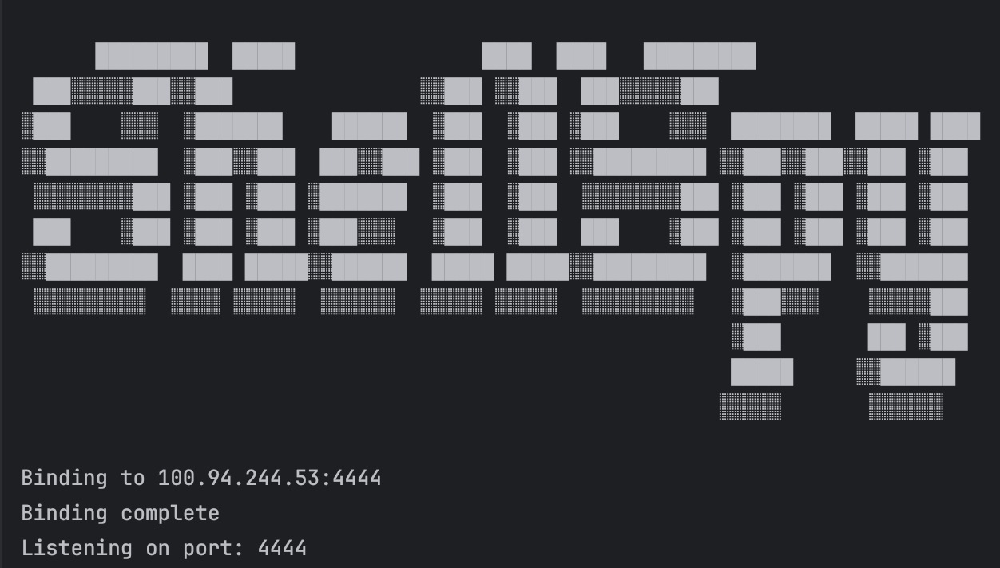
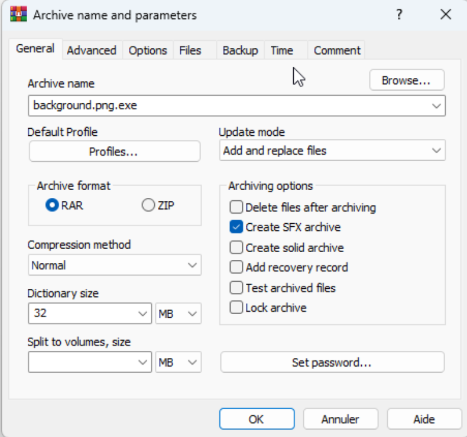
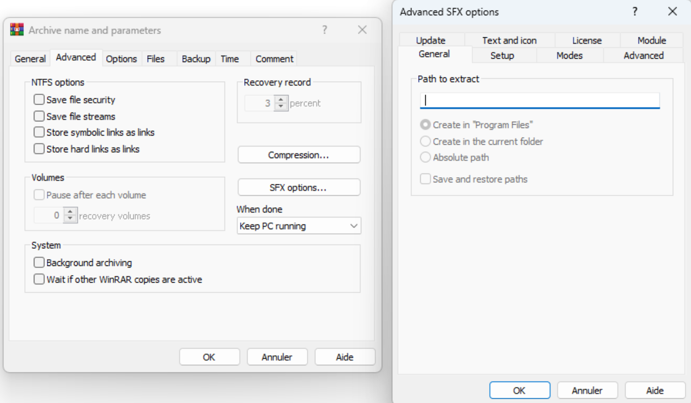
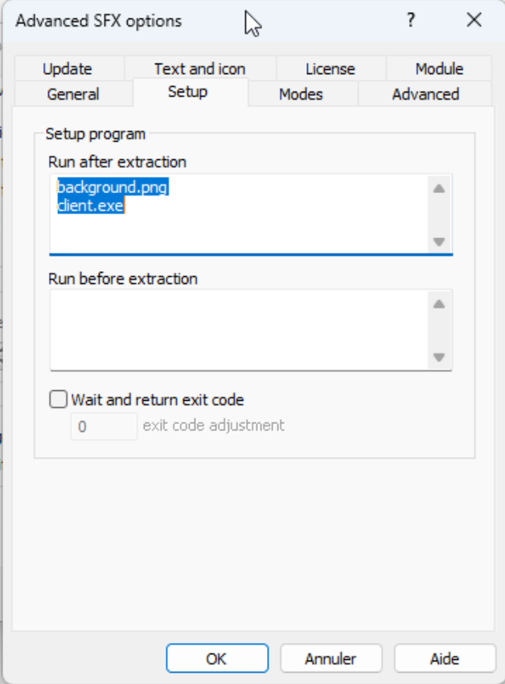

# ShellSPY

## Disclaimer

**Important**: This tool is designed strictly for educational purposes. Using this tool to gain unauthorized access, monitor, or control systems is illegal and unethical. It should only be utilized in controlled environments or with explicit authorization. The user assumes full responsibility for its usage, and the developers are not liable for any misuse or damage resulting from its use.

## Overview

This project introduces a Remote Access Trojan (RAT) called ShellSPY tailored for Windows operating systems. Its purpose is to enable remote users to exert control over a designated machine with a spectrum of functionalities. These functionalities include executing commands, capturing screenshots, streaming audio and video, logging keystrokes, managing files, and more. The tool was developed by a group of 3 cybersecurity students under the team name "DedSec.exe".

## Features

- **System Information**: Collects and sends the target machine's hostname, OS details, and MAC address to the server.
- **Command Execution**: Executes system commands and returns the output to the server.
- **File Transfer**: Sends and receives files between the client and server.
- **Screenshot Capture**: Captures and sends screenshots.
- **Screen Sharing**: Streams the target machine's screen in real-time.
- **Webcam Streaming**: Streams video from the target machine's webcam.
- **Audio Streaming**: Streams live audio from the target machine's microphone.
- **Audio Recording**: Records audio and saves it as a file.
- **Volume Control**: Adjusts the system's master volume level.
- **Keylogging**: Logs keystrokes and sends the data to the server.
- **Encryption/Decryption**: Encrypts and decrypts files using AES.
- **Browser History**: Extracts and sends browsing history from Chrome, Edge, and Opera.
- **Text to Speech**: Converts text to speech.
- **Wallpaper Change**: Changes the desktop wallpaper.
- **Fake BSOD**: Simulates a fake Blue Screen of Death.
- **Message Box**: Displays a message box on the target machine.
- **System Control**: Lock screen, shutdown, and mouse control.

## Available Commands:

### Connection Management:
- **list**: List available connections
- **exit**: Terminate the program and close connection

### File Operations:
- **download**: Download a file from the target machine
- **upload**: Upload a file to the target machine
- **encrypt**: Encrypt files on the target machine
- **decrypt**: Decrypt files on the target machine

### System Control:
- **cmd**: Open a command shell on the target machine
- **lock_screen**: Lock the screen of the target machine
- **taskkill**: Kill a process on the target machine
  - Usage: `taskkill`
- **portscanner**: Scan open ports on target machine

### Monitoring and Surveillance:
- **webcam**: Initiate webcam streaming from the target machine
- **voice_record**: Start or stop voice recording on the target machine
  - Usage: `voice_record --start` or `voice_record --stop`
- **screenshot**: Capture a screenshot from the target machine
- **keylogger**: Start or stop keylogging on the target machine
  - Usage: `keylogger --start` or `keylogger --stop`
- **screen_record**: Start or stop screen recording on the target machine
  - Usage: `screen_record --start` or `screen_record --stop`
- **screenshare**: Start screen sharing from the target machine
- **browser_history**: Retrieve browser history from the target machine
  - Usage: `browser_history`
- **audiostart**: Start streaming audio from the target machine
- **audiostop**: Stop streaming audio from the target machine

### Communication:
- **send_message**: Send a message to the target machine
- **speech**: Run a speech on the target machine

### System Settings:
- **volume**: Adjust system volume on the target machine
  - Usage: `volume -u` to set to 100% or `volume -d` to set to 0%
- **disable**: Disable mouse input on the target machine
  - Usage: `disable --mouse`
- **enable**: Enable mouse input on the target machine
  - Usage: `enable --mouse`
- **keyboard**: Set keyboard layout on the target machine
  - Usage: `keyboard --ru-RU`, `keyboard --ar-SA`, `keyboard --fr-FR`, `keyboard --en-US`
- **wallpaper**: Set wallpaper on the target machine

### Utility:
- **inloop**: Start or stop a service in a loop on the target machine
  - Usage: `inloop --start` or `inloop --stop`
- **bruteforce**: Perform a brute force attack on hashed passwords

### Miscellaneous:
- **!BSod**: Simulate a fake BSOD on the target machine
- **help**: Display this help menu

## Requirements

- Python 3.x
- External Modules

## Setup and Usage

### Server Setup

- **Change IP Address and Install Libraries**:
  - Before running the server, ensure that you change the IP address in the `server.py` script. Also, make sure to change the `save_directory` path in the `receive_file` function.

    ```bash
    pip install -r server_requirements.txt
    ```

- **Run the Server**:
  - Once the necessary libraries are installed and the IP address is updated, start the server by running:
    ```bash
    python server.py
    ```
    
  - The server will start listening for incoming connections. 

### Client Setup
There are two methods to run the client:
1. **Execute `client.py` with Python:**
    - **Install Required Libraries**:
    ```bash
    pip install -r client_requirements.txt
    ```

    - **Run the Client**:
    ```bash
    python client.py
    ```

2. **Convert `client.py` to an executable using PyInstaller:**


To convert the `client.py` script into a standalone executable file using PyInstaller, follow these steps:

1. **Install PyInstaller**:

    ```bash
    pip install pyinstaller
    ```


2. **Convert the Script**:
    - Navigate to the directory containing `client.py`.
    - Run the following command to create a single executable file without a console window:

        ```bash
        pyinstaller --onefile --noconsole client.py
        ```


### Injecting Executable into PNG File


1. **Create Combined Archive**:
    - On your desktop, select and right-click the real PNG  and the malicious executable, and select ‘Add to Archive…’ to create a combined archive.
    
    

2. **Rename the Archive**:
    - Rename the archive file to `background.png` (or any legitimate-looking name). Make sure ‘Create SFX archive’ is checked.

    

3. **Configure SFX Options**:
    - Go to Advanced > SFX options.
    
    

4. **Setup**:
    - Under the Setup tab, configure the following:
      - First, set it to run the real PNG .
      - Then, set it to run the malicious executable file.

    

5. **Modes**:
    - Under the Modes tab,
